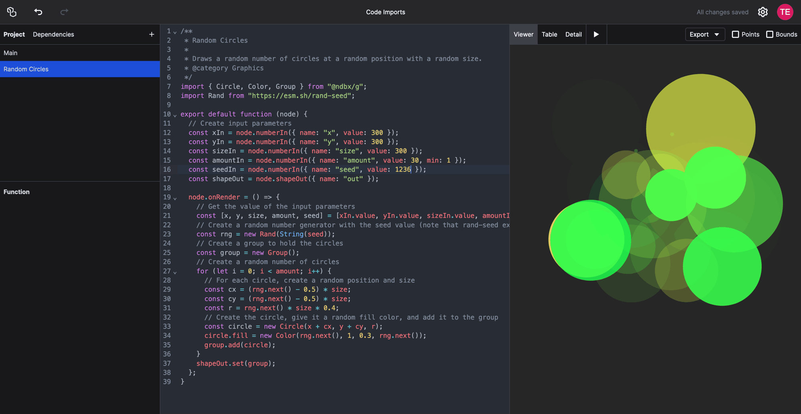

# Using External JavaScript Libraries

When coding, you can use existing JavaScript libraries to extend the functionality of NodeBox. You've already seen how you can use NodeBox's `@ndbx/g` library, but you can almost all available libraries on [npm](https://www.npmjs.com/). To import, we prefer using [esm.sh](https://esm.sh/), a modern CDN that allows you to import es6 modules from a URL. (You can also use [Skypack](https://www.skypack.dev/) or [jspm](https://jspm.org/cdn/jspm-io).)

## Tutorial: controllable random numbers

In generative design we often use random numbers. The issue with random numbers is that they're not **controllable**: every time you render the composition, you will get a different result, with no way to store or reproduce a given variation.

If you want to be able to use random numbers while still being able to "hold on" to a certain variation, you can use a library that generates random numbers based on a _seed value_: a fixed value that determines the sequence of random numbers generated by the library. If you use the same seed value, you will get the same sequence of random numbers every time you run the composition. What's more, somebody else can use the same seed value and get the same sequence of random numbers as you did.

In this tutorial, we'll use the [rand-seed](https://www.npmjs.com/package/rand-seed) library to create a small composition with circles. We'll use the `@ndbx/g` library to create the circles and the `rand-seed` library to generate random numbers:



Create a new function item in the outliner and name it "Random Circles". Add the following code:

```js
/**
 * Random Circles
 *
 * Draws a random number of circles at a random position with a random size.
 * @category Graphics
 */
import { Circle, Paint, Group } from "@ndbx/g";
import Rand from "https://esm.sh/rand-seed";

export default function (node) {
  // Create input parameters
  const xIn = node.numberIn({ name: "x", value: 300 });
  const yIn = node.numberIn({ name: "y", value: 300 });
  const sizeIn = node.numberIn({ name: "size", value: 300 });
  const amountIn = node.numberIn({ name: "amount", value: 30, min: 1 });
  const seedIn = node.numberIn({ name: "seed", value: 42 });
  const shapeOut = node.shapeOut({ name: "out" });

  node.onRender = () => {
    // Get the value of the input parameters
    const [x, y, size, amount, seed] = [xIn.value, yIn.value, sizeIn.value, amountIn.value, seedIn.value];
    // Create a random number generator with the seed value (note that rand-seed expects a string)
    const rng = new Rand(String(seed));
    // Create a group to hold the circles
    const group = new Group();
    // Create a random number of circles
    for (let i = 0; i < amount; i++) {
      // For each circle, create a random position and size
      const cx = (rng.next() - 0.5) * size;
      const cy = (rng.next() - 0.5) * size;
      const r = rng.next() * size * 0.4;
      // Create the circle, give it a random fill, and add it to the group
      const circle = new Circle(x + cx, y + cy, r);
      circle.fill = Paint.solid(rng.next(), 1, 0.3, rng.next());
      group.add(circle);
    }
    shapeOut.set(group);
  };
}
```

Note that we're importing the `rand-seed` library from a URL. This is possible because the library is available on [npm](https://www.npmjs.com/) and can be imported as an es6 module.

Once the project is saved, reload the window, then go to the Main network and add the `Random Circles` node. You can now control the number of circles, their size, and their position, and you can generate different variations by changing the seed value.

## Library Versions

When using external libraries, it's important to note that the version of the library you're using may change over time. If you want to ensure that your project remains consistent, you can specify the version of the library you want to use in the import statement. For example:

```js
import Rand from "https://esm.sh/rand-seed@2.1.7";
```

To know the version, type the URL without version number in the browser. ESM will redirect you to the latest version. You can then copy the URL with the version number.
