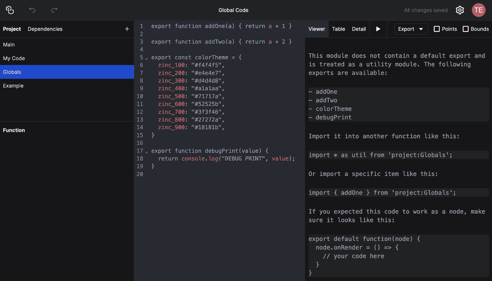

# Sharing Code Across Functions

If you have code that you want to share between multiple function items, you can create a global code item in the outliner. A good name for this is `Globals`. This code will be executed once when the project is loaded, and you can use it to define global variables, functions, or classes that can be used by other functions in the project.

A global code item functions like a regular function, only that it should not have a default export. Instead should have some named exports, like functions, e.g.:

```js
export function addOne(a) {
  return a + 1;
}

export function addTwo(a) {
  return a + 2;
}

export const colorTheme = {
  zinc_100: "#f4f4f5",
  zinc_200: "#e4e4e7",
  zinc_300: "#d4d4d8",
  zinc_400: "#a1a1aa",
  zinc_500: "#71717a",
  zinc_600: "#52525b",
  zinc_700: "#3f3f46",
  zinc_800: "#27272a",
  zinc_900: "#18181b",
};

export function debugPrint(value) {
  return console.log("DEBUG PRINT", value);
}
```

The viewer will show which functions are exported:



Then, in another function item, use this syntax to import:

```js
import { debugPrint } from "project:Globals";

// Somewhere in your code:
debugPrint(spec);
```
