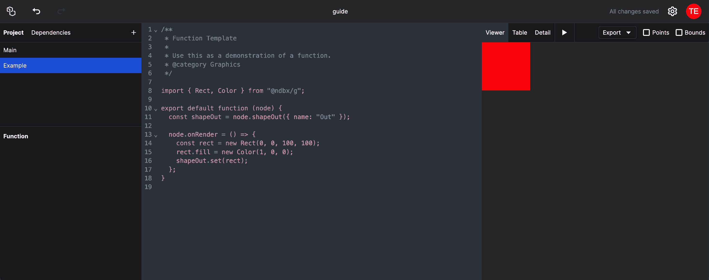

# Coding your own Nodes

In addition to the built-in nodes, you can create your own custom nodes using JavaScript to extend NodeBox's functionality. This tutorial will guide you through the process of creating a simple custom node.

## Creating a Code Node

In the outliner, click the "+" button to create a new item. Give it a name (e.g. "Example") and select "Function". You will see a basic template of a node in JavaScript:



## Adding parameters

To add parameters to your node, you can use any of the "in" functions, like `node.numberIn` or `node.stringIn`. For example, to add a number input to your node, you can use the following code:

```js
const valueIn = node.numberIn({ name: "value", value: 33 });
```

This code creates a number input named "value" with a default value of 0. You can then use this input in your node's code:

```js
node.onRender = () => {
  const value = valueIn.value;
  // Use the value in your rendering code
};
```

The following parameters are available:

- `node.numberIn({ name, value })`: Creates a number input.
- `node.stringIn({ name, value })`: Creates a string input.
- `node.booleanIn({ name, value })`: Creates a boolean input.
- `node.colorIn({ name, value })`: Creates a color input.
- `node.choiceIn({ name, value, choices})`: Creates a menu input with the specified options. The value will always be a string.
- `node.fileIn({ name, value })`: Creates a file input, allowing the user to upload files. The value will be the contents of the file.

## Adding input ports

To add input ports to your node, you can use the `node.shapeIn` for a shape, `node.tableIn` for a data table, and `node.specIn` for a Vega spec. Note that internally, these ports function exactly the same. Only the port color is different.

```js
const shapeIn = node.shapeIn({ name: "shape" });
const tableIn = node.tableIn({ name: "table" });
const specIn = node.specIn({ name: "spec" });
```

To use the input shape in your rendering code, you can access the `value` of the port, like so:

```js
node.onRender = () => {
  const shape = shapeIn.value;
  // Use the shape in your rendering code
};
```

## A simple example: a translate node

Here is a simple example of a custom node that translates (moves) a shape:

```js
import { Transform } from "@ndbx/g";

export default function (node) {
  const shapeIn = node.shapeIn({ name: "shape" });
  const xIn = node.numberIn({ name: "x", value: 0 });
  const yIn = node.numberIn({ name: "y", value: 0 });
  const shapeOut = node.shapeOut({ name: "out" });

  node.onRender = () => {
    const [shape, x, y] = [shapeIn.value, xIn.value, yIn.value];
    // Always copy the input shape!
    const newShape = shape.clone();
    // Create a new transformation object
    const transform = new Transform();
    transform.translate(x, y);
    newShape.applyTransform(transform);
    shapeOut.setValue(newShape);
  };
}
```

## Next Steps

In order to build nodes that work with graphics, you have to understand the NodeBox graphics library. Read [the NodeBox graphics documentation](/guide/graphics-api) to learn more about the library.
