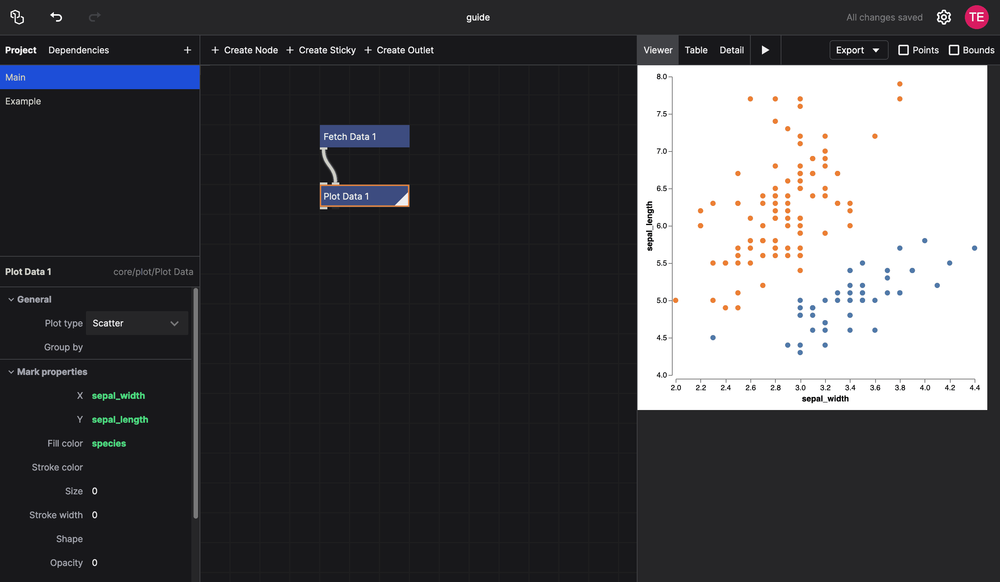
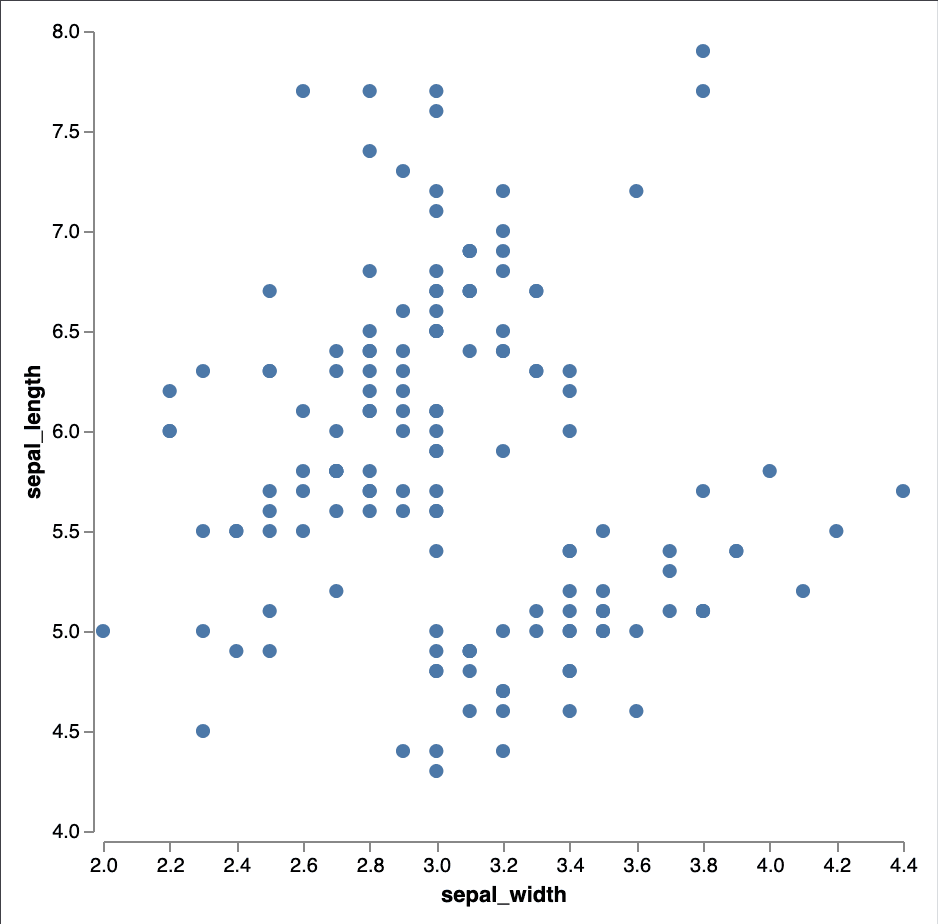
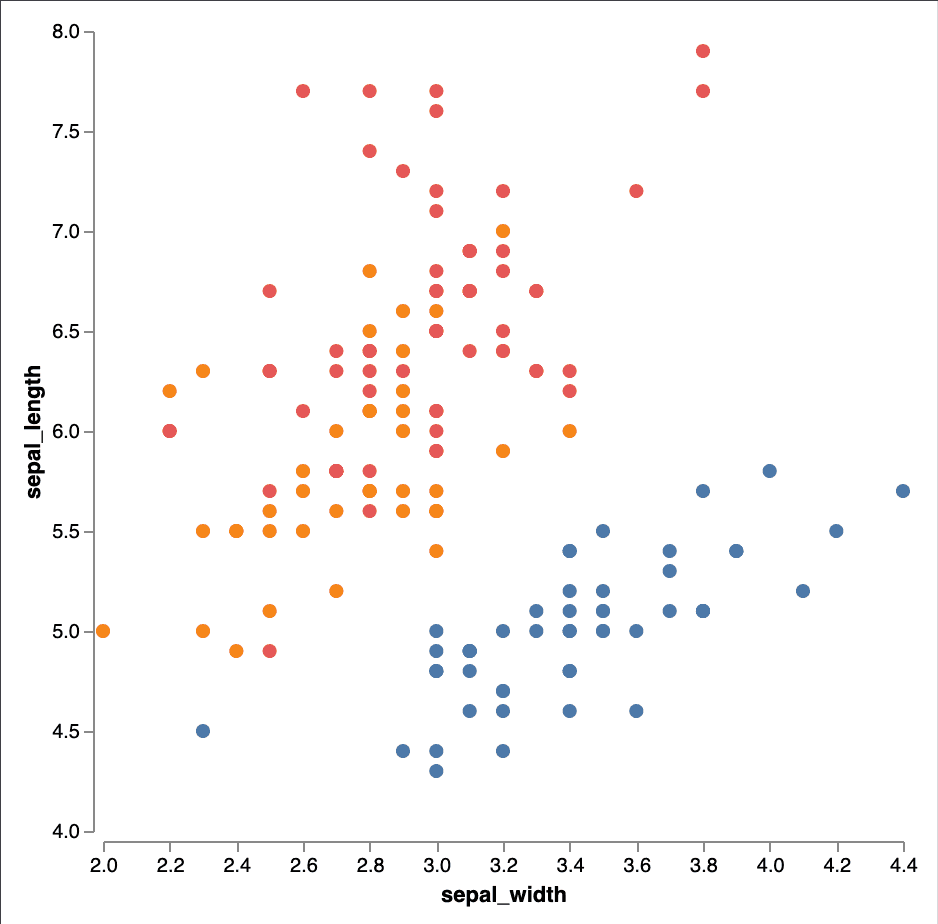

# Creating Basic Visualizations

Creating a basic scatter plot only requires a handful of nodes. In this guide, we'll walk you through the process of creating a simple visualization from scratch.

Here's what we're going to make:

## Fetching the Data

We'll start with a simple dataset containing [50 samples of Iris flowers](https://en.wikipedia.org/wiki/Iris_flower_data_set). This dataset comes preloaded with NodeBox and is very easy to use:

1. In the network view, click the "Create Node" button, or double-click in the empty space, to create a new node. Search for the `Fetch Data` node.
2. The `url` parameter of the `Fetch Data` node is already set to `https://data.nodebox.live/iris.csv`, which loads the Iris dataset.

The `Fetch Data` node is useful if you want to load data from a URL. If you have a file on your computer, you can use the `Import Data` node instead. It has a `file` parameter that allows you to select a file from your computer.

## Plotting the Data

In the network view, create a new node and search for the `Plot Data` node. This node takes a table as input and plots it as a scatter plot.

To connect the `Fetch Data` node to the `Plot Data` node, drag from the `out` port of the `Fetch Data` node to the `data` port of the `Plot Data` node. **Be careful**: this node has two input ports. The first node is for a `spec`, the description of the plot. The second port is for the actual data. Since `Fetch Data` returns a table, you'll need to connect the output to the second port.

To see the results of the plot, double-click the `Plot Data` node to make it the rendered node. You should see an empty scatter plot. That's because we didn't tell the node which columns to use for the X and Y axes.

## Configuring the Plot

To configure the plot, we need to specify which columns to use for the X and Y axes. The `Plot Data` node has two parameters: `x` and `y`. To use data to drive these values, we're going to use expressions:

1. Click the `{}` icon next to the `x` parameter to switch it to an expression. It will turn slightly green, indicating that it's now an expression.
2. Click the empty expression field, then type `sepal_width` and press Enter. This tells the node to use the `sepal_width` column for the X axis.
3. Repeat the process for the `y` parameter, using the `sepal_length` column.

You will now get a basic scatter plot:

We can visualize the different species by using an expression for the `Fill color` parameter.

1. Click the `{}` icon next to the `Fill color` parameter.
2. In the expression field, type `species` and press Enter.

We can now see that the different species are colored differently. We'll also notice that there is a correlation between the sepal width and sepal length of the Iris flowers, as well as the different species:

Note that we can also give fixed values to other parameters that we want to customize. For example, we can set the `Size` parameter to `10` to make the points smaller. We can also set the `Stroke color` to `lightgray` to give each point a slight outline.

## Next Steps

This is just the beginning! You can further customize your scatter plot by adding labels, changing the axis labels, or even adding a trend line. Read [customizing visualizations](customizing-visualizations) to learn more about the different ways you can enhance your visualizations.
