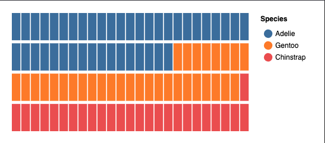
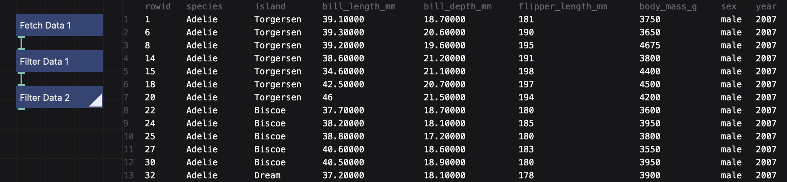
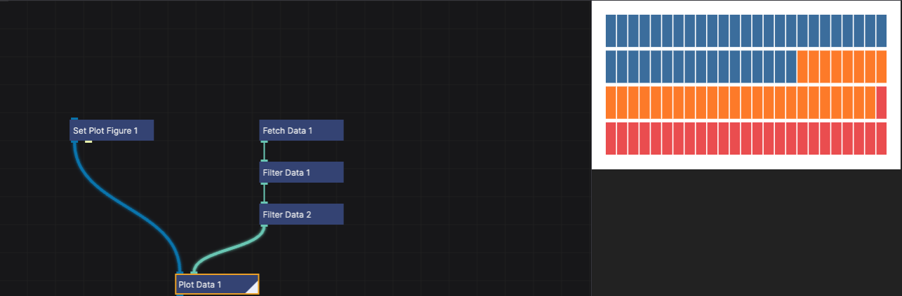
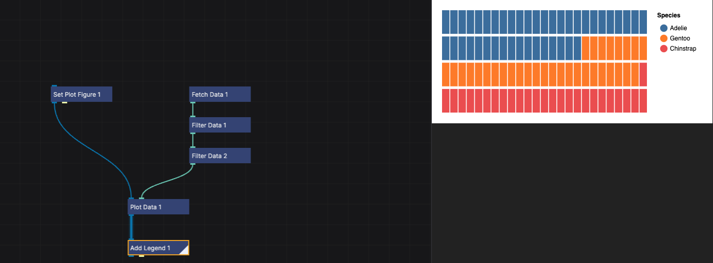
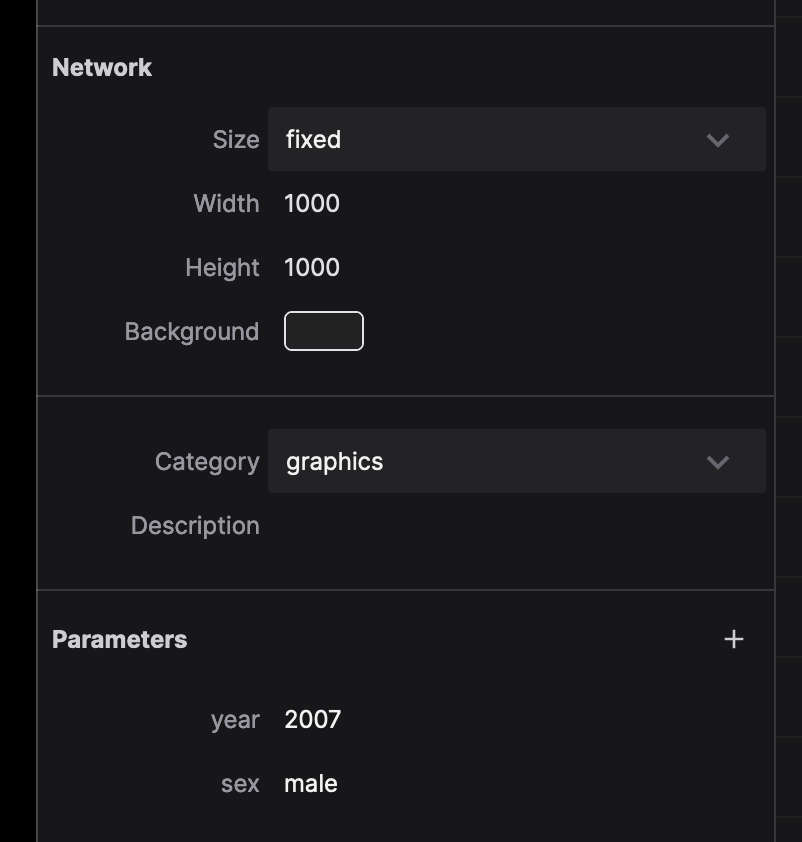

# Creating a Waffle Chart

This guide walks you through creating a waffle chart to visualize penguin data filtered by year and sex.

Here's what we're going to make:

## Fetching the Data

We'll use a [dataset of penguin measurements](https://allisonhorst.github.io/palmerpenguins/#about-the-data), hosted online.

1. In the network view, click the "Create Node" button or double-click in the empty space to create a new node. Search for the `Fetch Data` node.
2. Configure the `Fetch Data` node:
   - Set the `url` parameter to `https://data.nodebox.live/penguins.csv`.

## Filtering the Data

To focus on specific subsets of the penguin dataset, we'll apply filters for year and sex.

1. **Filter by Year**:

   - Add a `Filter Data` node.
   - Click the `⋮` next to `Left Value` and click `Toggle Expression`. Then type `year` (it should be green, indicating an expression).
   - Set the `Right Value` to a year value from the data set (e.g. `2007`).

2. **Filter by Sex**:

   - Add another `Filter Data` node.
   - Set the `Left Value` to the expression `sex` (again, it should be green).
   - Set the `Right Value` to `male`.

3. **Connect the nodes**:

   - Link the `Fetch Data` node to the first `Filter Data` node.
   - Connect the first `Filter Data` node to the second `Filter Data` node.

4. **Check the results**:
   - Double-click the second `Filter Data` node to see the filtered data in the Viewer.
   - If the data looks correct (only male penguins from 2007), proceed to the next step.

## Setting Up the Waffle Chart

Now we’ll configure the waffle chart to visualize the filtered data.

1. **Define the Chart Dimensions**:

   - Add a `Set Plot Figure` node.
   - Configure the `width`, `height`, and `padding` values to define the chart layout:
     - `width`: 400
     - `height`: 200
     - `padding`: 20

2. **Configure the Waffle Chart**:

   - Add a `Plot Data` node.
   - Set the following parameters:
     - `Plot Type`: **Waffle**
     - `Group By`: Toggle Expression, then type `species` to group the data by species.
     - `Fill Color`: Toggle expression, then type `species` column to color the different species.
     - `X`: Define the number of columns for the waffle chart, type: `1,25`
     - `Y`: Define the number of rows for the waffle chart, type: `1,4`

3. **Connect the nodes**:
   - Link the `Set Plot Figure` node to the `Plot Data` node.
   - Connect the second `Filter Data` node to the `Plot Data` node.
   - Double-click the `Plot Data` node to render the waffle chart.

## Adding a Legend

To make the chart more interpretable, we'll add a legend.

1. Add an `Add Legend` node.
2. Link the `Plot Data` node to the `Add Legend` node and double-click the `Add Legend` node to make it rendered.
3. Configure the following parameters:

   - `Title`: Add a descriptive title, such as "Species".
   - `Type`: Symbol
   - `Symbol shape`: Circle
   - Under Layout: `Orientation`: Right

## Publishing the Chart

In order to make the parameters for the year and sex available to the user, we need to _publish_ them.

1. Select the `Filter Data` node that filters by year.
2. In the properties panel, click the `⋮` button next to the `Right Value` parameter, then click `Publish Parameter`.
3. NodeBox will ask for the name of the parameter. Instead of `rightValue`, write `year` and click `Create Parameter`.

Do the same for the `Filter Data` node that filters by sex:

1. Select the `Filter Data` node that filters by sex.
2. In the properties panel, click the `⋮` button next to the `Right Value` parameter, then click `Publish Parameter`.
3. NodeBox will ask for the name of the parameter. Instead of `rightValue`, write `sex` and click `Create Parameter`.

These parameters will enable filtering based on user input. Click somewhere in the network view to deselect all the nodes. You can see that the network now has two new parameters: `year` and `sex`, with the values you set earlier.

## Next Steps

You’ve created a dynamic waffle chart for visualizing penguin data! Here are a few ways to customize or extend your project:

1. Use the network parameters to explore different years and sexes dynamically.
2. Adjust the legend and chart dimensions for better clarity and presentation.
3. Experiment with other plot types or grouping attributes to uncover new insights.
