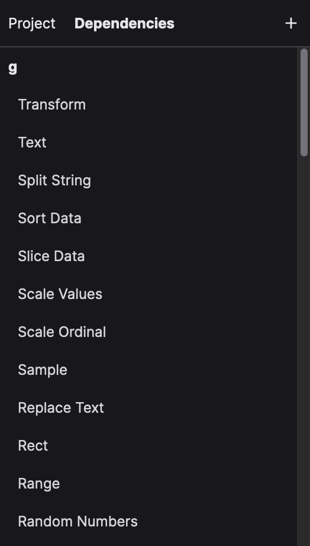
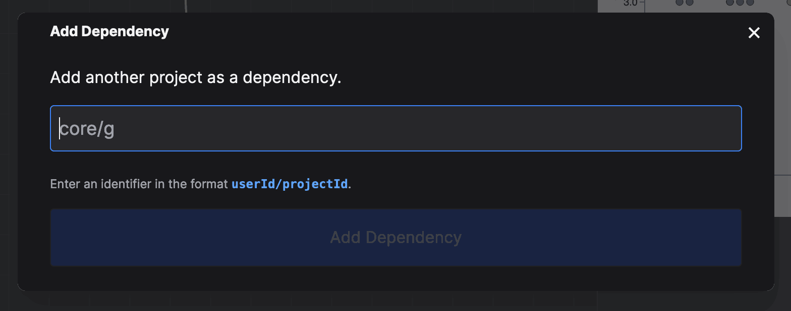

# Managing Dependencies

Except in rare circumstances, your project will always depend on libraries of existing code. We call these libraries
_dependencies_. Dependencies are simply other projects with pre-made functions for you to use.

All projects already have two existing dependencies:

- `core/g`: The core library of NodeBox Live, containing all the basic functions (e.g. `Rect`, `Transform`, `Merge Shapes`, etc.)
- `core/plot`: A library for plotting graphs. (e.g. `Plot Data`, `Add Legend`, etc.)

You can view all your dependencies by clicking on the "Dependencies" tab in the outliner:

Clicking an item will show the source code of that function. This is really handy if you want a template to start from.

## Adding a Dependency

To add a dependency, click the "+" icon _while on the dependencies tab_. This will show a dialog allowing you to type the name of the dependency. This always consists of the `userId` and `projectId`. NodeBox will check if the dependency exists, first.

**Important**: After adding a dependency, wait until the project is saved, then **reload** the browser window. This is necessary because NodeBox Live needs to download the code of the dependency and make it available to your project.

## Removing a Dependency

Currently, there is no way to remove a dependency, except in "raw" mode. That's because NodeBox Live doesn't check if you're not using certain functionality.
