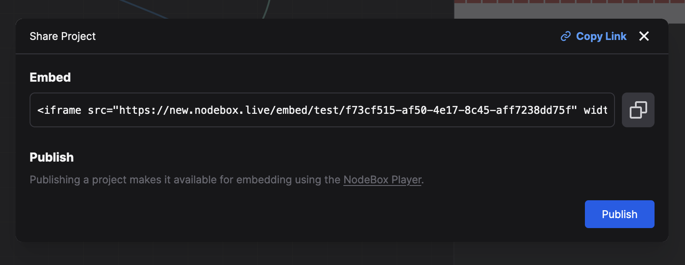

# Embedding NodeBox Visualizations

NodeBox visualizations can be embedded using either an `<iframe>` or a React component.

## Publishing your project

Before embedding, publish your project through the Share dialog in the top-right corner of the editor. Publishing is only available for _NodeBox Plus_ users.

## Iframe

The simplest embedding method is using an `<iframe>`. Get the embed code from the Share dialog:



## React Component

For programmatic control over your visualization, use the React component. First, install the package:

```bash
npm install @ndbx/runtime
```

The simplest way to use this component is:

```js
import { NodeBoxPlayer } from "@ndbx/runtime";

<NodeBoxPlayer userId="yourUserId" projectId="yourProjectId" />;
```

You can also provide an optional `item` with the name of the item to render. If you don't provide it, the first item in your project will be rendered (usually named `Main`).

```js
<NodeBoxPlayer userId="yourUserId" projectId="yourProjectId" item="Main" />
```

If you want to be able to control the parameters of your visualization, you can provide a `values` prop. This should be an object with the parameter names as keys and the values as values. Use `onProjectLoaded` to get a reference to the `Context` object, which you can use to look up items and their parameters.

To see what you can do with the `Context` and parameters, examine the [types file](https://unpkg.com/browse/@ndbx/runtime/dist/types.d.ts).

```js
import { NodeBoxPlayer, Context, LiteralValue } from '@ndbx/runtime';

function App() {
  const [values, setValues] = useState<Record<string, LiteralValue>>({});

  function handleProjectLoaded(cx: Context) {
    const mainItem = cx.lookupItemByName('self/self/Main');
    console.log(mainItem?.parameters);
    setValues({ fullName: "Frederik" });
  }

  function handleProjectError(error: Error) {
    console.error(error);
  }

  return (
    <NodeBoxPlayer
      userId="yourUserId"
      projectId="yourProjectId"
      onProjectLoaded={handleProjectLoaded}
      onProjectError={handleProjectError}
      values={values}
    />
  );
}
```

## Configuring the endpoints

By default, the component will use the default endpoints, going through our NodeBox API servers. If you want to self-host a project so you're independent from our servers, you can provide the following URL templates:

```text
publishedUrlTemplate="https://your-host.example.com/nodebox/{{ userId }}/{{ projectId }}/versions/published.json"
assetsUrlTemplate="https://your-host.example.com/nodebox/{{ userId }}/{{ projectId }}/blobs/{{ hash }}"
libUrlTemplate="https://your-host.example.com/nodebox/{{ userId }}/{{ projectId }}/lib/{{ file }}.js"
```

Importantly, you don't just have to provide your document, but also the `core/g` and `core/plot` projects, as well as any others that your project depends on. Once your project is published, the Share dialog offers a _self-hosting ZIP_ containing all these files in the directory layout the templates expect. The same file is available at `https://new.nodebox.live/api/download-published/yourUserId/yourProjectId`. Unpack it on any static file host, then configure the `NodeBoxPlayer` like this:

```js
<NodeBoxPlayer
  userId="yourUserId"
  projectId="yourProjectId"
  publishedUrlTemplate="https://your-host.example.com/nodebox/{{ userId }}/{{ projectId }}/versions/published.json"
  assetsUrlTemplate="https://your-host.example.com/nodebox/{{ userId }}/{{ projectId }}/blobs/{{ hash }}"
  libUrlTemplate="https://your-host.example.com/nodebox/{{ userId }}/{{ projectId }}/lib/{{ file }}.js"
/>
```
