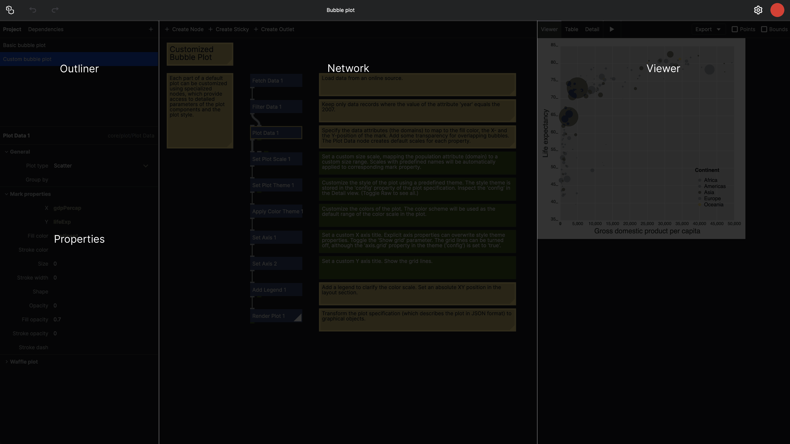
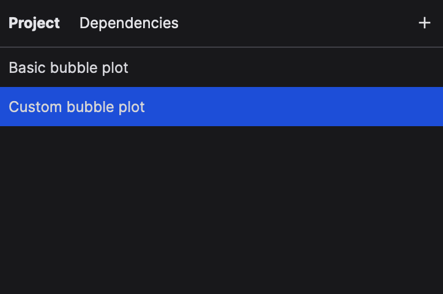
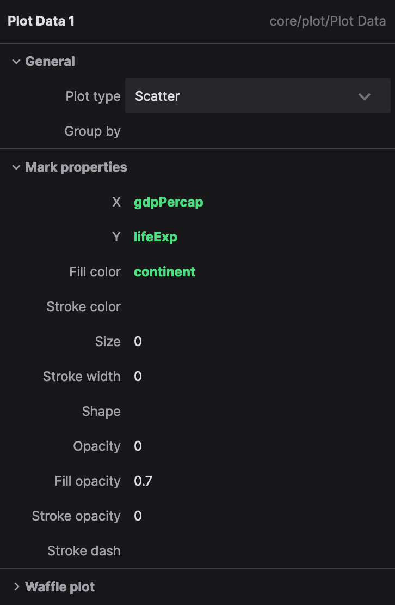
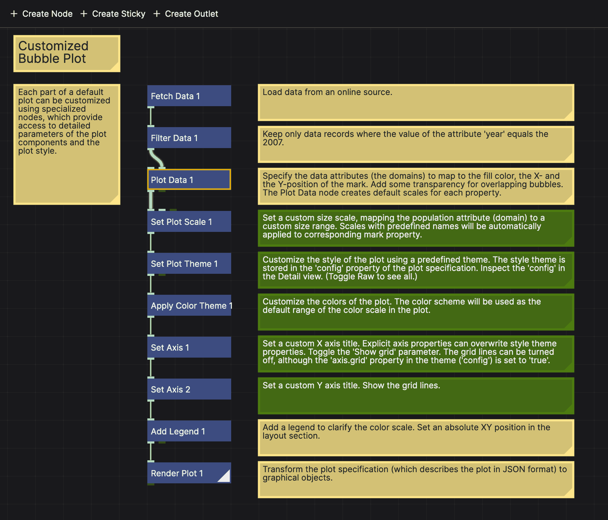
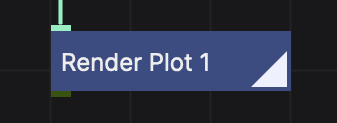
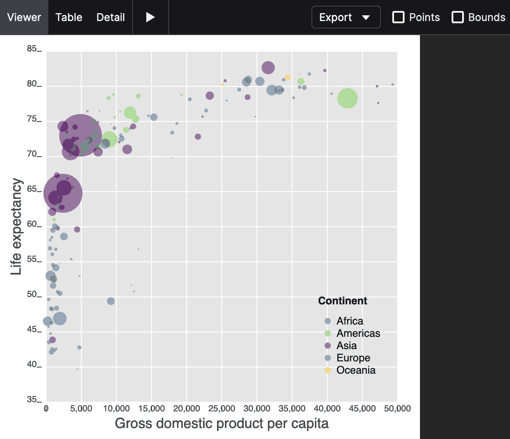
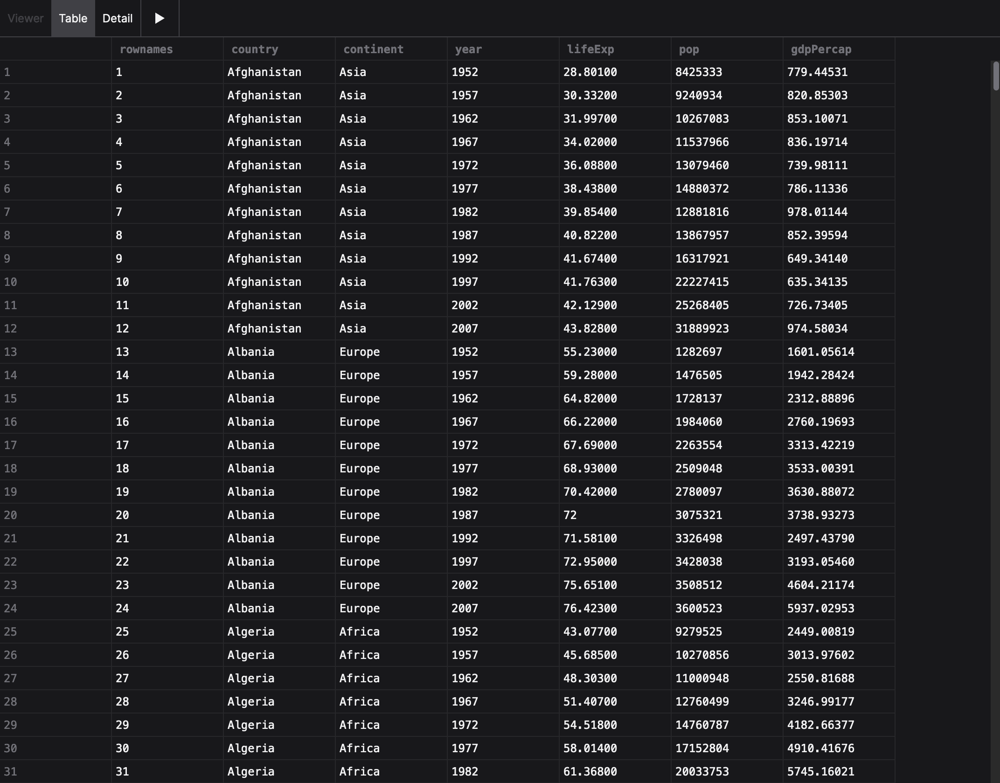
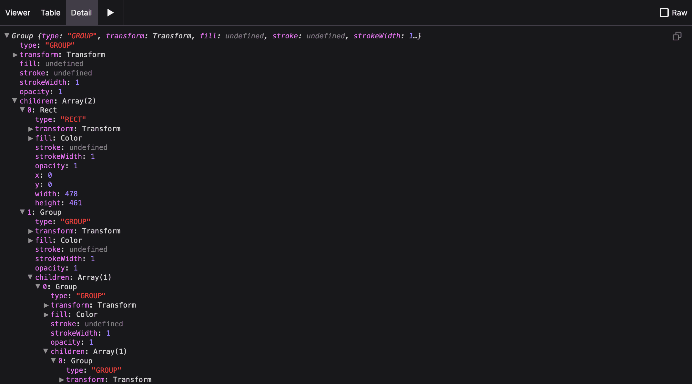

# The NodeBox Interface

NodeBox is a node-based application for generative design. It's a visual programming environment that allows you to create animations, illustrations, data visualizations, and more. The interface is divided into three main areas: the outliner, the network editor and the viewer:

Here's a brief overview of each area:

## Outliner

The outliner gives an overview of all the items in your project (the networks and the functions), as well as the dependencies of your project (all imported functions). Use the "+" button to make a new item.

To rename an item, double-click its name.

To export an item as SVG, right-click on an item and select "Copy as SVG".

You can _pin_ an item so it is always visible in the viewer. To do this, hover over the item and click the pin icon on the right. This is useful when [coding your own nodes](/guide/coding-tutorial).

## Properties

The properties panel shows the parameters of the selected node. These depend on the node type; for example a Rect node will have the position (x and y), the size (width and height) as well as the color (fill, stroke and stroke width) as parameters.

If no node is selected, the properties of the network are shown. These are the global width and height, as well as the background color, of this network.

Properties in green are _expressions_. Expressions allow you to reference attributes of the incoming data. They are useful whenever we connect a table to a node, such as in the _Plot Data_ node you see here. In this example, the X value is driven by the `gdpPerCap` column of the incoming table, whereas the Y value is driven by the `lifeExp` column. The fill color is controlled by the `continent` column.

To switch from a constant value to an expression, click the `{}` icon to the right of the parameter row.

## Network Editor

The network editor is where you build your node network. It consists of nodes (blue rectangles) and connections between them. Nodes represent functions, whereas connections represent the flow of data between those functions.

The "rendered node" is the node that is currently being displayed in the viewer. It is indicated by a triangle in the bottom-left corner:

To make a node the rendered node, double-click it.

The _active node_, indicated by the yellow border, is the node whose properties are displayed in the property panel. To make a node active, click on it.

You can pan the network view around by dragging with the left mouse button. You can zoom in and out with the mouse wheel. To reset your view, right-click and select "Reset View". To fit the network to the view, right-click and select "Fit View".

To select a number of nodes, hold the shift key while dragging a selection box around the nodes you want to select. Use shift + click to add or remove nodes from the selection.

### Creating a new node

To create a new node, _double-click_ on an empty space in the network editor. This will open the _Create Node_ dialog, where you can search for the node you want to create. Alternatively, you can press the "Create Node" button to open the dialog; the node will then be created at a random position in the view.

### Creating a connection

To create a connection between two nodes, click on the output port of the first node, then drag to the input port of the second node. The connection will be created automatically.

To disconnect a node, drag from the input port to an empty space in the network editor.

### Stickies

Stickies are small notes that you can attach to the network editor. They are useful for documenting your network or for leaving yourself notes. To create a sticky, click "Create Sticky" in the header of the network editor. To edit a sticky, double-click it.

## The Viewer

The viewer shows the output of the _rendered node_. It is where you see the result of your network. The viewer can display shapes, animations, and plots.

The viewer has a play button to play interactive graphics, as well as an export menu to download the output as an SVG image.

Checking the "Points" option visualizes the bounding boxes of all the shapes in the output.

The viewer has two alternate modes for looking at the output: the table viewer and the detail viewer.

### Table

The table viewer shows the data in a table, allowing you to inspect the data that is being passed through the network.

### Detail

The detail viewer shows the output in an "inspector view", allowing you to drill down into the properties of the output. This is useful for inspecting complex objects, such as SVG paths or Vega plot specifications.
