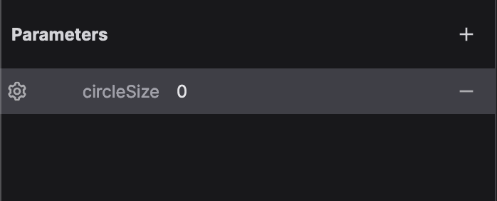
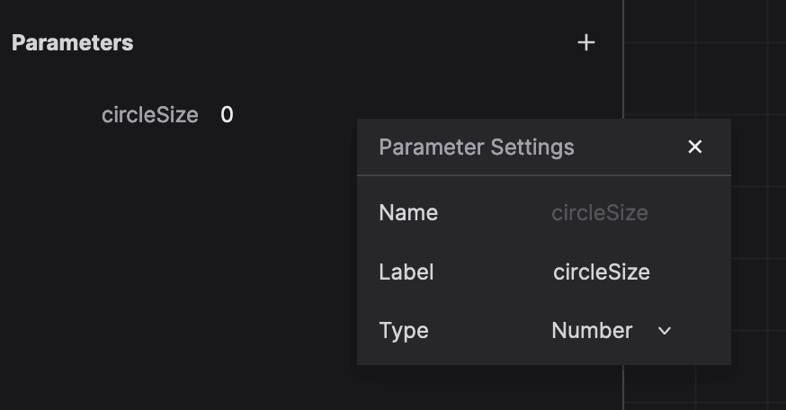
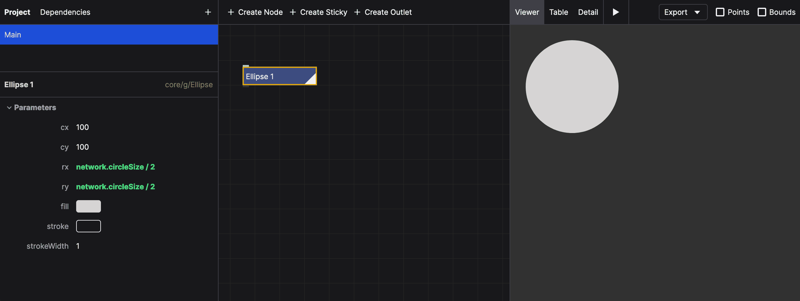
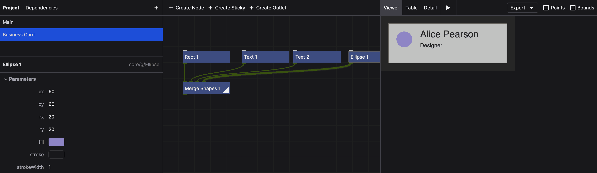
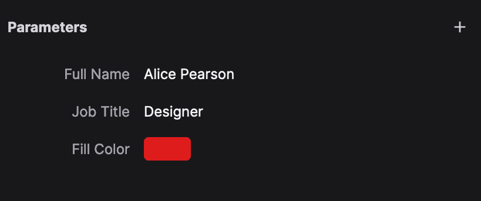

# Publishing a Project

In order to prepare a project for [embedding](/guide/embedding-nodebox), you need to publish it.

Most likely, your project will have external parameters that you want to control from the outside. You can define these parameters in the properties of the network.

## Defining Parameters

To add a parameter to a network, make sure no node is selected in the network editor. The properties panel will show the properties of the network. In the "Parameters" section, click the "+" button to add a new parameter, then enter a parameter name. When hovering over the new parameter, you can click the gear icon to configure it:

Here you can set the label of the parameter and its type (number, string, boolean, color, or file):

To set the default value of the parameter, just enter a value in the field. This value will be used when the project is embedded and no value is provided.

## Using a parameter

To use the value of the published parameter, use `network.parameterName` as an expression in your nodes. For example, if you have a parameter named `circleSize`, you can use it in the `rx` and `ry` parameters of an Ellipse node by typing `network.circleSize` in the expression field. (Because we're talking about size, we probably want to divide the value by 2.)

Now, whenever you embed the project, you can control the size of the circle from the outside. See the [embedding guide](/guide/embedding-nodebox) for more information.

## Tutorial: Business Card Generator

We're going to make a simple business card generator that allows you to customize the name, job title, and color of the card "logo". We'll use the `Text`, `Rect` and `Ellipse` nodes to create the card, and the `Merge Shapes` node to combine them.

### Setting up the network

- In a new network, set the width and height of the network to 340 and 140, respectively.
- Create a `Rect` node that will function as the background. Set x and y to `20`, width to `300`, height to `100`, and fill to light gray. Add a 2 pixel stroke with a dark gray color.
- Add a `Text` node that will display the name. Set x to `100`, y to `55`, text to `Alice Pearson`, and font size to `24`. Set the fill to dark gray.
- Add a `Merge Shapes` node to see the result. Connect the `Rect` to the first input and the `Text` node to the second input.
- Add another `Text` node for the job function. Set the text to `Designer`, x to `100`, y to `80`, font size to `14`, and fill to the same gray color. Connect this node to the third input of the `Merge Shapes` node.
- Finally, add an `Ellipse` node for the "logo". Set cx and cy to `60`, and rx and ry to `20`, and fill to a light blue color. Connect this node to the fourth input of the `Merge Shapes` node.

Your network should look like this:

### Creating the parameters

Let's create the network parameters. Click somewhere in the network view to deselect all nodes. In the properties panel, click the "+" button in the "Parameters" section to add these three parameters:

- `fullName` of type String and the label `Full Name`. Set the value to `Alice Pearson`.
- `jobTitle` of type String and the label `Job Title`. Set the value to `Designer`.
- `fill` of type Color and the label `Fill Color`. Use the color picker to set the value to red.

The properties panel should look like this:

### Using the parameters

Now we need to use these parameters in our nodes. In the first `Text` node, change the text property to an expression by clicking the `{}` icon. Set the expression to `network.fullName`. Do the same for the second `Text` node, using `network.jobTitle` for the text property. For the `Ellipse` node, use `network.fill` for the fill property.

You should now be able to change the name, job title, and color of the logo by changing the parameters in the properties panel:

<video src="./media/publishing/business-card-change-color.mp4" autoplay muted loop></video>
