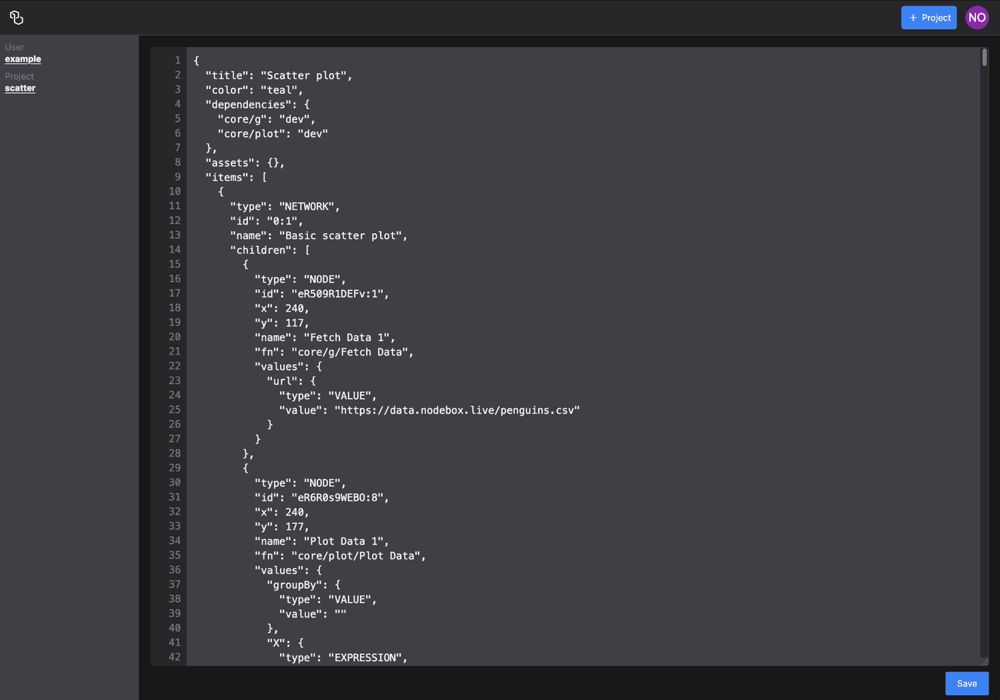

# Raw Mode

Sometimes, you need to be able to edit the project file directly. This is called "raw mode". It allows you to edit the project file as if it were a text file.

**Important**: In raw mode, it is really easy to break your project. Only do this if you know what you're doing!

## Entering Raw Mode

Because this is an dangerous operation, you need to explicitly go into raw mode by changing the URL:

The link will look like this:

```text
https://new.nodebox.live/raw/yourUserId/yourProjectId
```

So, for example, to see the raw mode version of the scatter plot example, you would change the URL like this:

<https://new.nodebox.live/example/scatter> → <https://new.nodebox.live/raw/example/scatter>

The interface looks like this:



The NodeBox project file is in [JSON format](https://en.wikipedia.org/wiki/JSON). Make sure to use the proper syntax when editing the file. NodeBox Live checks the file for errors and will not save it if it is invalid.

## Main Properties of the Project

The following are the top-level keys of a project:

- `title`: The title of the project. Note that changing this doesn't change it in the overview!
- `color`: The color tile of the project. Like the title, changing this doesn't change it in the overview.
- `dependencies`: An object with the [dependencies](/guide/dependencies) of the project. Each dependency contains a key consisting of `userId/projectId` and the version, probably `dev`, which means it goes to the live version.
- `assets`: A list of assets for the project.
- `items`: The networks and functions of this project.
- `id`: The project ID.
- `formatVersion`: The version of the project file format. This is currently `4`.
